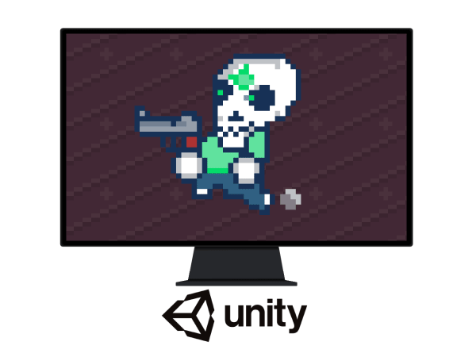

  <h1>Crypt Creepers</h1>

 
  

**Table of content**
- [Game Summary](#game-summary)
- [Description](#description)
- [Visual Style](#visual-style)
- [Player Objectives](#player-objectives)

# Game Summary

**Common Information**

**Target Audience:** All ages  
**Genre:** Action 2D  
**Engine:** Unity  
**Release Platform:** NA  
**Release Store:** NA  

# Description

Kill enemies, collect items, and don't let the enemies get close to you. Score as many points as you can by killing enemies. Collect clocks to increase remaining time.

# Visual Style
Retro 2D Style.

# Player Objectives
- Kill enemies
- Collect items
- Don't die

